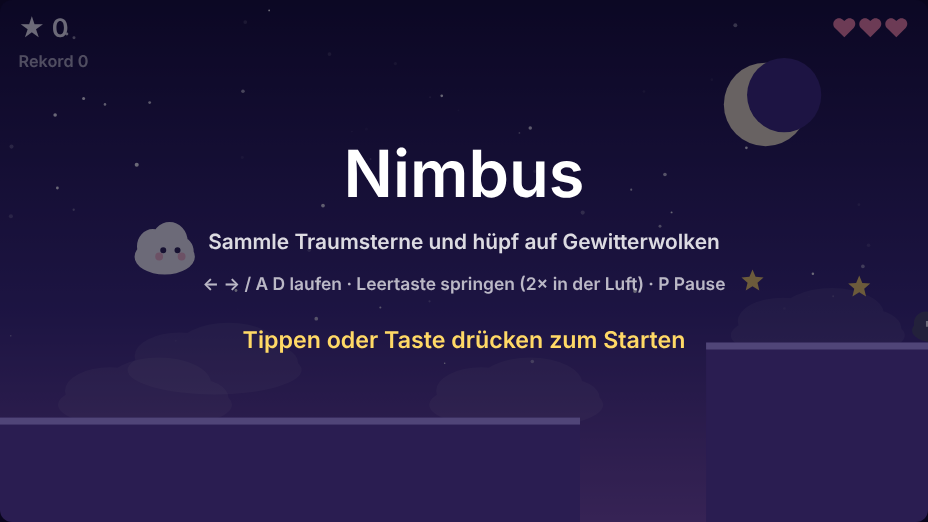
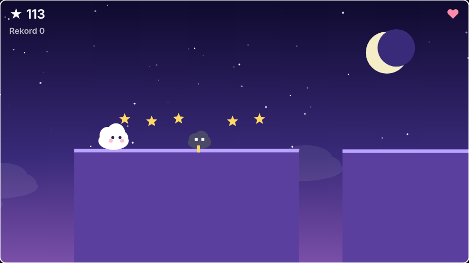
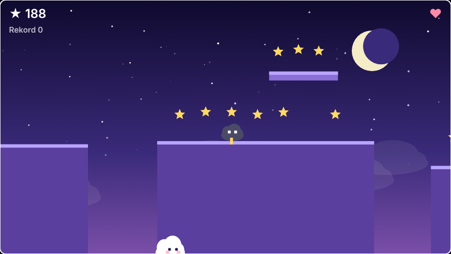

<div align="center">

# ☁️ Nimbus

**Ein verträumtes Jump'n'Run für den Browser – hüpf als kleine Wolke durch die Nacht, sammle Traumsterne und weiche Gewitterwolken aus.**


</div>

---

## ✨ Features

- 🌙 **Endlose Traumwelt** – das Level wird beim Laufen zufällig generiert und wird mit der Zeit schwerer
- ⭐ **Traumsterne sammeln** für Punkte, auch auf schwebenden Plattformen
- ⛈️ **Gewitterwolken** laufen auf den Plattformen – spring von oben drauf, um sie zu besiegen
- 🪽 **Doppelsprung** – Wolken können in der Luft noch einmal abstoßen
- 🎮 **Fühlt sich gut an** – variable Sprunghöhe, Coyote-Time und Sprung-Puffer
- 📱 **Tastatur und Touch** – spielbar am Rechner und auf dem Handy
- 🏆 **Rekord** wird lokal im Browser gespeichert
- 🪶 **Null Abhängigkeiten** – eine einzige JS-Datei, ~500 Zeilen, scharf auf jedem Display (HiDPI)
- ⏸️ **Automatische Pause**, wenn der Tab im Hintergrund liegt

## 📸 Screenshots

<div align="center">

| Startbildschirm | Gameplay |
| :---: | :---: |
|  |  |



</div>

## 🚀 Spielen

### Windows – ein Doppelklick

1. Repository herunterladen (**Code → Download ZIP**) und entpacken
2. **`start.bat`** doppelklicken
3. Der Browser öffnet `http://localhost:8080` – fertig

> `start.bat` startet einen kleinen lokalen Webserver (Python, `py` oder Node.js `npx serve` – was gerade installiert ist). Das ist nötig, weil Browser ES-Module nicht direkt von `file://` laden.

### macOS / Linux

```bash
python3 -m http.server 8080
# danach http://localhost:8080 öffnen
```

## 🎮 Steuerung

| Aktion | Tastatur | Touch |
| --- | --- | --- |
| Nach links laufen | `←` oder `A` | linkes Viertel des Bildschirms |
| Nach rechts laufen | `→` oder `D` | zweites Viertel |
| Springen | `Leertaste`, `↑` oder `W` | rechte Hälfte |
| Doppelsprung | Springen in der Luft noch einmal drücken | in der Luft noch einmal tippen |
| Pause | `P` oder `Esc` | – |
| Start / Neustart | beliebige Taste | Tippen |

> 💡 **Tipp:** Halte die Sprungtaste länger für höhere Sprünge und lass sie früh los für kleine Hüpfer.

## 🕹️ Gameplay

| Element | Wirkung |
| --- | --- |
| ⭐ Traumstern | **+10** Punkte |
| ⛈️ Gewitterwolke von oben treffen | **+25** Punkte und Extra-Sprung |
| ⛈️ Gewitterwolke seitlich berühren | **−1** Leben |
| 🕳️ In eine Lücke fallen | **−1** Leben, Respawn auf der nächsten Plattform |
| 🏃 Weiter nach rechts kommen | Entfernung zählt als Punkte |

Du startest mit **3 Leben ♥**. Nach einem Treffer bist du kurz unverwundbar. Sind alle Leben weg, bist du aufgewacht – dein Punktestand wird mit dem Rekord verglichen.

## 🧩 In eine eigene Seite oder App einbinden

Das Spiel ist ein eigenständiges ES-Modul und lässt sich in jeden Container einbauen:

```html
<div id="game"></div>
<script type="module">
  import { createNimbusGame } from './nimbus-game.js';

  const game = createNimbusGame(document.getElementById('game'), {
    onGameOver: (score) => console.log('Punkte:', score),
    onStar: () => console.log('Stern gesammelt'),
    storageKey: 'nimbus-highscore', // Schlüssel für den Rekord im localStorage
  });

  // game.pause();
  // game.resume();
  // game.destroy(); // entfernt Canvas und alle Event-Listener
</script>
```

| Option | Typ | Beschreibung |
| --- | --- | --- |
| `onGameOver(score)` | Funktion | wird am Spielende mit der Punktzahl aufgerufen |
| `onStar()` | Funktion | wird bei jedem eingesammelten Stern aufgerufen |
| `storageKey` | String | Name des `localStorage`-Eintrags für den Rekord |

Das Canvas füllt die Breite des Containers aus (16:9) und passt sich Größenänderungen automatisch an.

## 📁 Projektstruktur

```
Traum/
├── index.html        # Demo-Seite
├── nimbus-game.js    # das komplette Spiel als ES-Modul
├── start.bat         # Windows-Starter mit lokalem Webserver
└── docs/img/         # Screenshots und GIF für dieses README
```

## 🗺️ Ideen für die Zukunft

- [ ] Eigene Grafik für Nimbus und die Gegner
- [ ] Soundeffekte und sanfte Hintergrundmusik
- [ ] Power-ups (Regenbogen-Dash, Schild)
- [ ] Verschiedene Traumwelten mit eigenen Farben
- [ ] Online-Bestenliste
- [ ] Anbindung an die Schlaf-App

---

<div align="center">

Gemacht mit ☁️ und ein bisschen Schlaf.

</div>
