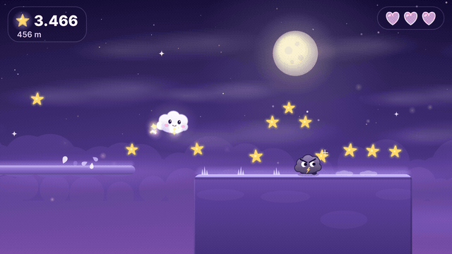
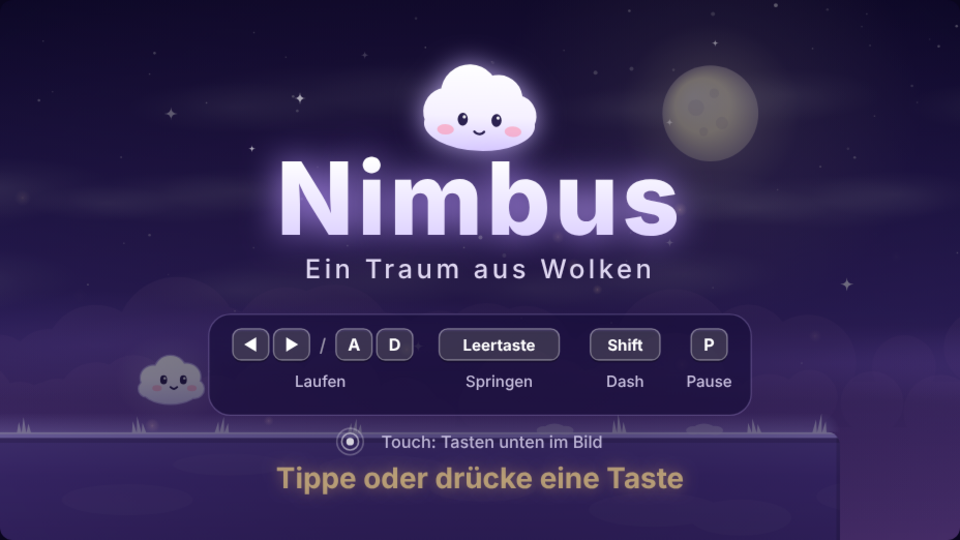
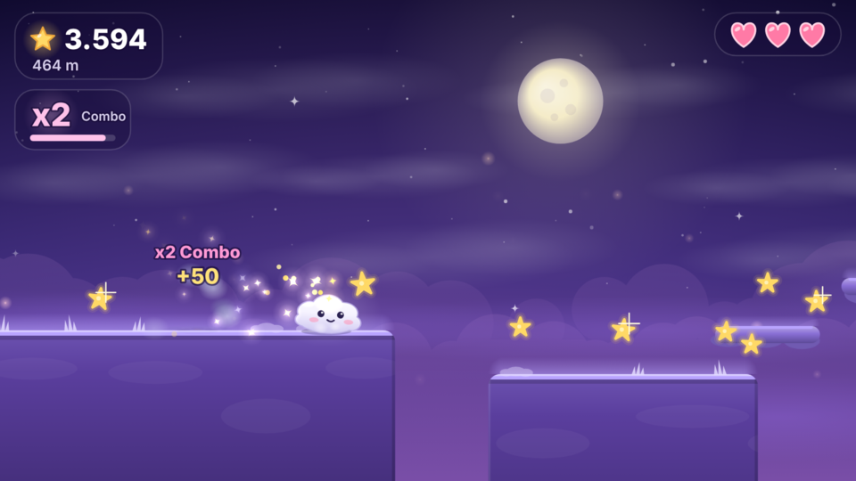
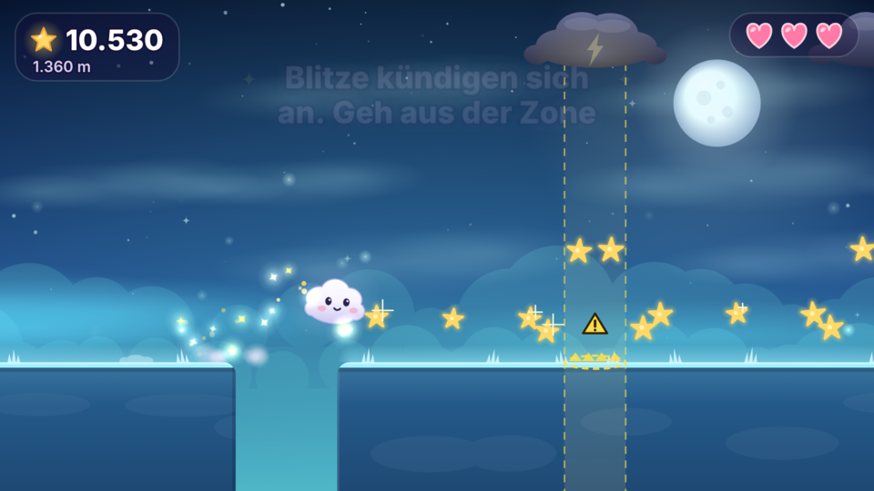
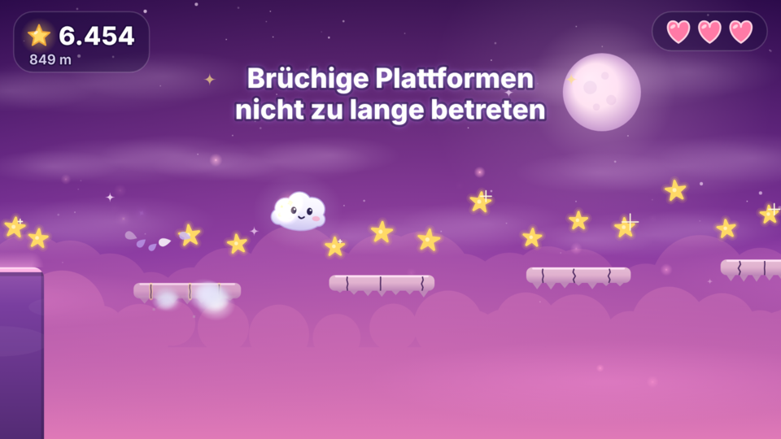
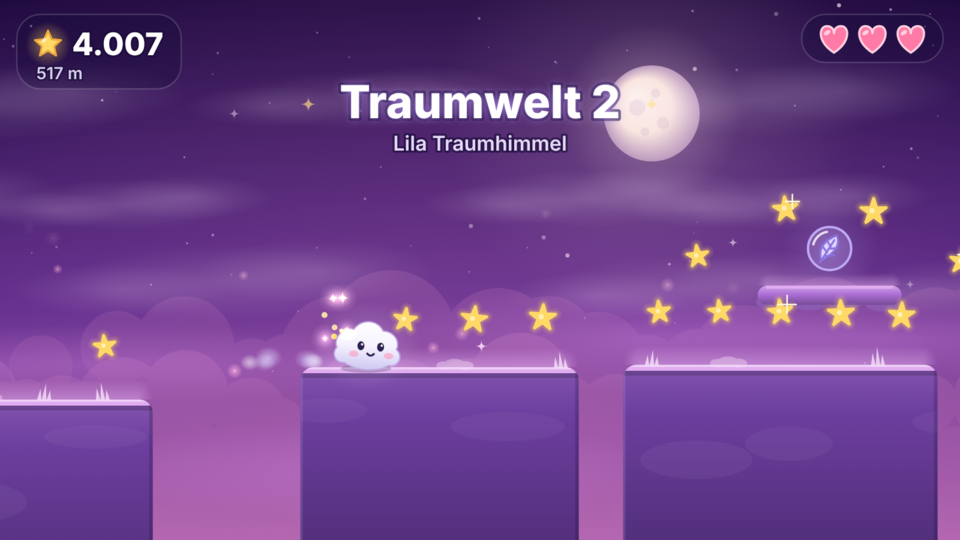
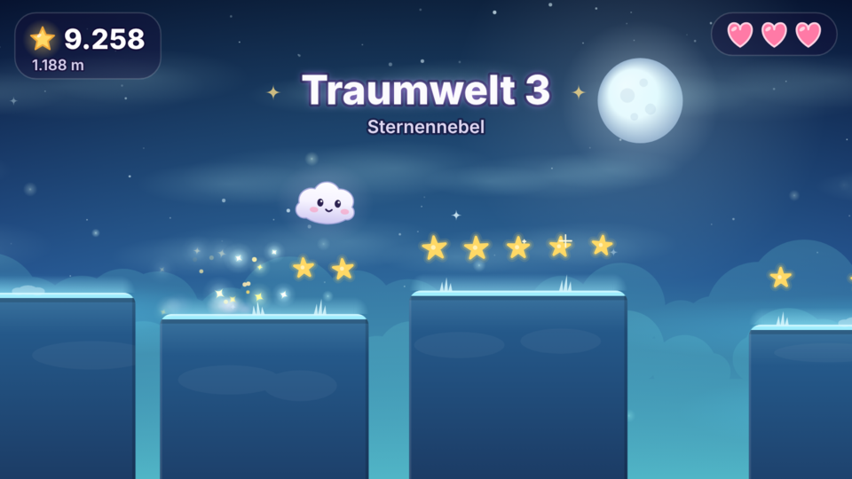
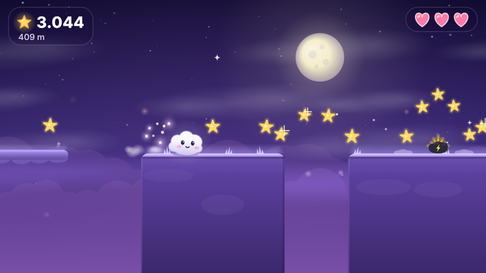
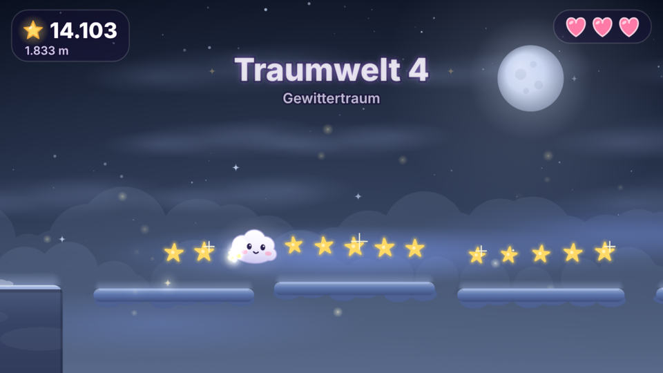
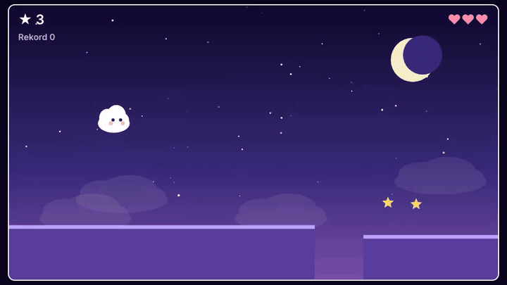

<div align="center">

# ☁️ Nimbus

**Ein verträumtes Jump'n'Run für den Browser. Du bist eine kleine Wolke, hüpfst durch vier Traumwelten, sammelst Sterne und tanzt den Gewitterwolken auf dem Kopf herum.**



</div>

## Worum es geht

Nimbus läuft komplett im Browser auf HTML5 Canvas, ganz ohne Abhängigkeiten, ohne Build und ohne Engine. Die Welt entsteht beim Laufen aus bewusst gestalteten Abschnitten. Jeder Abschnitt ist vorher geprüft worden: Jeder Sprung ist schaffbar, nichts schlägt aus dem Nichts zu, und jede Gefahr kündigt sich an. Du lernst eine Mechanik nach der anderen kennen, bis am Ende alles zusammenkommt.

Nach wenigen Sekunden hast du es verstanden. Danach wird es mit jeder Traumwelt ein Stück kniffliger.

## Schnellstart

**Windows:** Repository herunterladen und entpacken, dann `start.bat` doppelklicken. Der Browser öffnet sich mit dem Spiel. Das Skript startet dafür einen kleinen lokalen Webserver (Python oder Node.js), weil Browser ES Module nicht direkt von der Festplatte laden.

**macOS und Linux:**

```bash
python3 -m http.server 8080
```

Danach `http://localhost:8080` öffnen.

## Steuerung

| Aktion | Tastatur | Touch |
| :--- | :--- | :--- |
| Laufen | `←` `→` oder `A` `D` | linke und rechte Pfeiltaste unten links |
| Springen | `Leertaste`, `↑` oder `W` | große Taste unten rechts |
| Doppelsprung | in der Luft noch einmal springen | in der Luft noch einmal tippen |
| Regenbogen Dash | `Shift`, `X` oder `K` | Dash Taste (erscheint, solange der Dash aktiv ist) |
| Pause | `P` oder `Esc` | Pausetaste oben rechts |
| Neustart | beliebige Taste | Tippen |

Halte die Sprungtaste länger für höhere Sprünge und lass sie früh los für kleine Hüpfer. Kurz nach dem Verlassen einer Kante kannst du noch springen, und ein zu früh gedrückter Sprung wird gemerkt.

## So funktioniert das Spiel

Du hast drei Leben. Punkte gibt es für zurückgelegte Meter, Sterne, besiegte Gegner und Traumtore.

| Was | Punkte |
| :--- | :--- |
| Meter laufen | 1 pro Meter |
| Traumstern | 10 |
| Fallender Risikostern | 25 |
| Ereignissterne | 5 |
| Gegner von oben besiegt | 25, bei Combo 50, 75, 100 |
| Traumtor | 100 mal Nummer des Tors |

**Combo:** Besiegst du mehrere Gegner kurz nacheinander, steigt der Faktor von x1 bis x4. Nach etwa dreieinhalb Sekunden ohne Treffer verschwindet die Combo, ein eigener Treffer beendet sie sofort.

**Wenn etwas schiefgeht:** Du wirst zurückgestoßen und bist kurz unverwundbar. Fällst du in einen Abgrund, setzt dich das Spiel auf eine sichere Plattform vor dir, und mindestens zwei Sekunden lang kann dir nichts passieren. Am Ende erfährst du, woran es lag.

## Gefahren

| Gefahr | Verhalten | Wie du damit umgehst |
| :--- | :--- | :--- |
| Stachelwolke | steht still auf einer Plattform | überspringen, nicht berühren |
| Blitzzone | lädt sich auf, flackert, schlägt dann senkrecht ein | die markierte Säule rechtzeitig verlassen, die Warnung dauert fast eine Sekunde |
| Brüchige Plattform | wackelt nach kurzer Zeit und zerfällt | weiterlaufen, sie kommt später zurück |
| Bewegliche Plattform | fährt waagerecht oder senkrecht | sie trägt dich mit, einfach abwarten und aufspringen |
| Windzone | schiebt dich zur Seite oder hebt dich an | der Wind ist immer schwächer als du, du bleibst Herr der Lage |
| Regenwolke | der Boden wird rutschig | etwas früher bremsen |
| Fallender Stern | rieselt langsam vom Himmel | wer mutig ist, holt ihn sich für Extrapunkte |

## Gegner

Alle Gegner kannst du von oben besiegen. Jeder zeigt vor seinem Angriff, was er gleich tut.

| Gegner | Verhalten |
| :--- | :--- |
| Gewitterwolke | läuft auf der Plattform hin und her, bleibt an der Kante stehen und dreht sich dann um |
| Hüpfer | zieht sich zusammen, springt dann auf der Stelle, zielt aber nie auf dich |
| Fliegende Wolke | schwebt in sanften Wellen auch über Abgründen |
| Sturmwolke | erkennt dich in der Nähe, lädt sich sichtbar auf, stürmt los und braucht danach eine Pause |

## Powerups

| Powerup | Wirkung |
| :--- | :--- |
| Schild | fängt einen Treffer ab |
| Regenbogen Dash | 8 Sekunden lang kannst du waagerecht dashen und dabei Gegner besiegen |
| Sternmagnet | 8 Sekunden lang fliegen Sterne in deiner Nähe zu dir |
| Traumfeder | ein zusätzlicher Luftsprung, bis zu zwei lassen sich aufsparen |

## Traumwelten und Traumtore

Etwa alle 650 Meter steht ein leuchtender Mondring, das Traumtor. Wer hindurchläuft, bekommt Bonuspunkte und ein Herz zurück. Die Welt wechselt dann ihre Farben.

| Welt | Stimmung |
| :--- | :--- |
| 1 Mitternacht | tiefes Violett mit sternklarem Himmel |
| 2 Lila Traumhimmel | rosa Abendlicht |
| 3 Sternennebel | kühles Blau und Türkis |
| 4 Gewittertraum | dunkle Wolken mit Wetterleuchten |

## Dream Events

Ab etwa 400 Metern passiert hin und wieder etwas Besonderes: **Sternschnuppen** regnen vom Himmel, ein **Supermond** bringt mehr Sterne, der **Traumsturm** weht Böen über das Land und lockt mehr Gegner an, und der **Sternschauer** lässt dich Sterne einsammeln wie im Märchen.

## Schwierigkeitskurve

Das Spiel wird nicht einfach schneller. Es führt Neues ein und kombiniert es später.

| Strecke | Was dich erwartet |
| :--- | :--- |
| 0 bis 250 m | Einschlafen: Plattformen, Sterne, die erste Lücke |
| 250 bis 500 m | Erste Gegner und Stachelwolken |
| 500 bis 800 m | Bewegliche Plattformen und Regen |
| 800 bis 1200 m | Brüchige Plattformen, Hüpfer, Blitze, fallende Sterne |
| 1200 bis 1700 m | Wind, fliegende Wolken, Sturmwolken |
| ab 1700 m | Kombinationen aus allem, die Kurve steigt weiter |

Zwischendurch gibt es immer wieder ruhige Abschnitte zum Durchatmen. Insgesamt stecken 43 Abschnitte im Spiel. Der Generator wählt sie nach Strecke und Schwierigkeit aus und prüft jede Verbindung auf Machbarkeit.

## Bilder

<div align="center">

| | |
| :---: | :---: |
|  |  |
| Titelbild | Combo mit Gewitterwolken |
|  |  |
| Blitzzone mit Warnsäule | Brüchige Plattformen |
|  |  |
| Traumtor und Weltwechsel | Welt 3: Sternennebel |
|  |  |
| Stachelwolke | Welt 4: Gewittertraum |

</div>

## In die eigene Seite einbauen

```html
<div id="game"></div>
<script type="module">
  import { createNimbusGame } from './nimbus-game.js';

  const game = createNimbusGame(document.getElementById('game'), {
    onGameOver: (score, result) => console.log(score, result),
    onStar: () => console.log('Stern gesammelt'),
    debug: false,
  });

  // game.pause();  game.resume();  game.restart();  game.destroy();
</script>
```

| Option | Beschreibung |
| :--- | :--- |
| `onGameOver(score, result)` | am Ende eines Laufs, `result` enthält Punkte, Distanz, Sterne, Gegner, beste Combo, Zeit und Ursache |
| `onStar()` | bei jedem eingesammelten Stern |
| `onStats(stats)` | wenn die gespeicherten Bestwerte aktualisiert wurden |
| `storageKey` | Schlüssel im `localStorage`, Standard `nimbus-highscore` |
| `seed` | fester Startwert für immer dieselbe Welt, zum Beispiel für Wettbewerbe |
| `debug` | zeigt die Debug Anzeige, Standard `false` |

Das Canvas füllt die Breite des Containers aus (16:9), ist für hochauflösende Bildschirme scharf und pausiert automatisch, wenn der Tab im Hintergrund liegt. Bei `prefers-reduced-motion` entfallen Wackeln und Blitzen.

## Bestwerte

Nimbus merkt sich lokal im Browser deine beste Punktzahl, die weiteste Strecke, die meisten Sterne, die höchste Combo, die besiegten Gegner und den längsten Lauf. Nach jedem Spiel siehst du dein Ergebnis und ob du einen neuen Traumrekord aufgestellt hast.

## Debug Modus

Mit `debug: true` zeigt das Spiel unten links FPS, Distanz, Schwierigkeit, den aktuellen Abschnitt, aktive Gegner und Plattformen, Partikel, Geschwindigkeit von Nimbus und alle Hitboxen. `F3` schaltet die Anzeige um.

## Für Entwickler

```
Traum/
├── index.html           Demo Seite
├── nimbus-game.js       öffentliche API, Canvas, Spielschleife
├── start.bat            Windows Starter
├── game/                Spiellogik und Darstellung
│   ├── sim.js           ein Simulationsschritt, ohne DOM und deterministisch
│   ├── generator.js     Abschnitte auswählen, verbinden, prüfen
│   ├── chunks/          die 43 Abschnitte
│   ├── player.js, enemies.js, obstacles.js, platforms.js, collectibles.js, gates.js, events.js
│   └── render/          Hintergrund, Welt, Figuren, HUD, Bildschirme
├── tests/               Tests ohne Browser, dazu ein spielender Bot
└── docs/                Architektur und Bilder
```

Die gesamte Spiellogik läuft ohne Browser und ist deterministisch. Mit demselben Seed und denselben Eingaben entsteht immer dasselbe Spiel. Das macht Tests und einen Bot möglich.

```bash
npm test                          # alle Tests (Node 22, keine Pakete nötig)
node tests/bot-run.mjs 3500 1 4   # Bot spielt 3500 Meter auf den Seeds 1 bis 4
```

Der Bot rechnet vor jeder Entscheidung mehrere Eingabefolgen voraus und zeigt so, ob eine Stelle überhaupt ohne Schaden schaffbar ist. Wie die Module zusammenspielen, steht in [docs/ARCHITEKTUR.md](docs/ARCHITEKTUR.md).

## Wie alles anfing

Nimbus begann als einfacher Endlos Läufer mit einer Wolke, Sternen und Gewitterwolken. Die erste Version liegt weiter im Verlauf und diese Bilder erinnern daran.

<div align="center">

</div>

## Ideen für später

Eigene Grafik und Sound, weitere Traumwelten, eine Online Bestenliste und eine Anbindung an die Schlaf App Fluxona.
